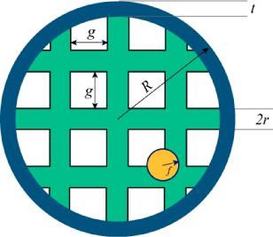

# Problem A. Saving The Universe

The urban legend goes that if you go to the Google homepage and search for "Google", the universe will implode. We have a secret to share... It is true! Please don't try it, or tell anyone. All right, maybe not. We are just kidding.

The same is not true for a universe far far away. In that universe, if you search on any search engine for that search engine's name, the universe does implode!

To combat this, people came up with an interesting solution. All queries are pooled together. They are passed to a central system that decides which query goes to which search engine. The central system sends a series of queries to one search engine, and can switch to another at any time. Queries must be processed in the order they're received. The central system must never send a query to a search engine whose name matches the query. In order to reduce costs, the number of switches should be minimized.

Your task is to tell us how many times the central system will have to switch between search engines, assuming that we program it optimally.

## Input

The first line of the input file contains the number of cases, N. N test cases follow.

Each case starts with the number S -- the number of search engines. The next S lines each contain the name of a search engine. Each search engine name is no more than one hundred characters long and contains only uppercase letters, lowercase letters, spaces, and numbers. There will not be two search engines with the same name.

The following line contains a number Q -- the number of incoming queries. The next Q lines will each contain a query. Each query will be the name of a search engine in the case.

## Output

For each input case, you should output:

	Case #X: Y

where X is the number of the test case and Y is the number of search engine switches. Do not count the initial choice of a search engine as a switch.
Limits

	0 < N ≤ 20

### Small dataset

	2 ≤ S ≤ 10
	
	0 ≤ Q ≤ 100

### Large dataset

	2 ≤ S ≤ 100
	
	0 ≤ Q ≤ 1000

## Sample

### Input 

	2
	5
	Yeehaw
	NSM
	Dont Ask
	B9
	Googol
	10
	Yeehaw
	Yeehaw
	Googol
	B9
	Googol
	NSM
	B9
	NSM
	Dont Ask
	Googol
	5
	Yeehaw
	NSM
	Dont Ask
	B9
	Googol
	7
	Googol
	Dont Ask
	NSM
	NSM
	Yeehaw
	Yeehaw
	Googol

### Output 

	Case #1: 1
	Case #2: 0

In the first case, one possible solution is to start by using Dont Ask, and switch to NSM after query number 8.
For the second case, you can use B9, and not need to make any switches.

# Problem B. Train Timetable

A train line has two stations on it, A and B. Trains can take trips from A to B or from B to A multiple times during a day. When a train arrives at B from A (or arrives at A from B), it needs a certain amount of time before it is ready to take the return journey - this is the turnaround time. For example, if a train arrives at 12:00 and the turnaround time is 0 minutes, it can leave immediately, at 12:00.

A train timetable specifies departure and arrival time of all trips between A and B. The train company needs to know how many trains have to start the day at A and B in order to make the timetable work: whenever a train is supposed to leave A or B, there must actually be one there ready to go. There are passing sections on the track, so trains don't necessarily arrive in the same order that they leave. Trains may not travel on trips that do not appear on the schedule.

## Input

The first line of input gives the number of cases, N. N test cases follow.
Each case contains a number of lines. The first line is the turnaround time, T, in minutes. The next line has two numbers on it, NA and NB. NA is the number of trips from A to B, and NB is the number of trips from B to A. Then there are NA lines giving the details of the trips from A to B.

Each line contains two fields, giving the HH:MM departure and arrival time for that trip. The departure time for each trip will be earlier than the arrival time. All arrivals and departures occur on the same day. The trips may appear in any order - they are not necessarily sorted by time. The hour and minute values are both two digits, zero-padded, and are on a 24-hour clock (00:00 through 23:59).
After these NA lines, there are NB lines giving the departure and arrival times for the trips from B to A.

## Output

For each test case, output one line containing "Case #x: " followed by the number of trains that must start at A and the number of trains that must start at B.

## Limits

	1 ≤ N ≤ 100

### Small dataset

	0 ≤ NA, NB ≤ 20

	0 ≤ T ≤ 5

### Large dataset

	0 ≤ NA, NB ≤ 100

	0 ≤ T ≤ 60

## Sample

### Input 

	2
	5
	3 2
	09:00 12:00
	10:00 13:00
	11:00 12:30
	12:02 15:00
	09:00 10:30
	2
	2 0
	09:00 09:01
	12:00 12:02

### Output 

	Case #1: 2 2
	Case #2: 2 0

# Problem C. Fly Swatter

What are your chances of hitting a fly with a tennis racquet?

To start with, ignore the racquet's handle. Assume the racquet is a perfect ring, of outer radius R and thickness t (so the inner radius of the ring is R−t).

The ring is covered with horizontal and vertical strings. Each string is a cylinder of radius r. Each string is a chord of the ring (a straight line connecting two points of the circle). There is a gap of length g between neighbouring strings. The strings are symmetric with respect to the center of the racquet i.e. there is a pair of strings whose centers meet at the center of the ring.

The fly is a sphere of radius f. Assume that the racquet is moving in a straight line perpendicular to the plane of the ring. Assume also that the fly's center is inside the outer radius of the racquet and is equally likely to be anywhere within that radius. Any overlap between the fly and the racquet (the ring or a string) counts as a hit.

## Input

One line containing an integer N, the number of test cases in the input file.

The next N lines will each contain the numbers f, R, t, r and g separated by exactly one space. Also the numbers will have at most 6 digits after the decimal point.

## Output

N lines, each of the form "Case #k: P", where k is the number of the test case and P is the probability of hitting the fly with a piece of the racquet.

Answers with a relative or absolute error of at most 10-6 will be considered correct.

## Limits

f, R, t, r and g will be positive and smaller or equal to 10000.

	t < R
	
	f < R
	
	r < R

### Small dataset

	1 ≤ N ≤ 30

The total number of strings will be at most 60 (so at most 30 in each direction).

### Large dataset

	1 ≤ N ≤ 100

The total number of strings will be at most 2000 (so at most 1000 in each direction).

## Sample

### Input 

	5
	0.25 1.0 0.1 0.01 0.5
	0.25 1.0 0.1 0.01 0.9
	0.00001 10000 0.00001 0.00001 1000
	0.4 10000 0.00001 0.00001 700
	1 100 1 1 10

### Output 

	Case #1: 1.000000
	Case #2: 0.910015
	Case #3: 0.000000
	Case #4: 0.002371
	Case #5: 0.573972

