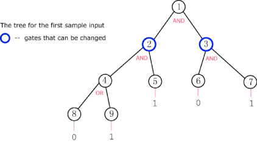

# Problem A. Cheating a Boolean Tree

For this problem we will consider a type of binary tree that we will call a boolean tree. In this tree, every row is completely filled, except possibly the last (deepest) row, and the nodes in the last row are as far to the left as possible. Additionally, every node in the tree will either have 0 or 2 children.

What makes a boolean tree special is that each node has a boolean value associated with it, 1 or 0. In addition, each interior node has either an "AND" or an "OR" gate associated with it. The value of an "AND" gate node is given by the logical AND of its two children's values. The value of an "OR" gate likewise is given by the logical OR of its two children's values. The value of all of the leaf nodes will be given as input so that the value of all nodes can be calculated up the tree.

The root of the tree is of particular interest to us. We would really like for the root to have the value V, either 1 or 0. Unfortunately, this may not be the value the root actually has. Luckily for us, we can cheat and change the type of gate for some of the nodes; we can change an AND gate to an OR gate or an OR gate to an AND gate.

Given a description of a boolean tree and what gates can be changed, find the minimum number of gates that need to be changed to make the value of the root node V. If this is impossible, output "IMPOSSIBLE" (quotes for clarity).

Input

The first line of the input file contains the number of cases, N. N test cases follow.

Each case begins with M and V. M represents the number of nodes in the tree and will be odd to ensure all nodes have 0 or 2 children. V is the desired value for the root node, 0 or 1.

M lines follow describing each of the tree's nodes. The Xth line will describe node X, starting with node 1 on the first line.

The first (M−1)/2 lines describe the interior nodes. Each line contains G and C, each being either 0 or 1. If G is 1 then the gate for this node is an AND gate, otherwise it is an OR gate. If C is 1 then the gate for this node is changeable, otherwise it is not. Interior node X has nodes 2X and 2X+1 as children.

The next (M+1)/2 lines describe the leaf nodes. Each line contains one value I, 0 or 1, the value of the leaf node.

To help visualize, here is a picture of the tree in the first sample input.

 
Output

For each test case, you should output:

Case #X: Y
where X is the number of the test case and Y is the minimum number of gates that must be changed to make the output of the root node V, or "IMPOSSIBLE" (quotes for clarity) if this is impossible.
Limits

1 < N ≤ 20

Small dataset

2 < M < 30

Large dataset

2 < M < 10000

Sample

Input 
 	
2
9 1
1 0
1 1
1 1
0 0
1
0
1
0
1
5 0
1 1
0 0
1
1
0

Output 

Case #1: 1
Case #2: IMPOSSIBLE

In case 1, we can change the gate on node 3 to an OR gate to achieve the desired result at the root.
In case 2, only the root can be changed but changing it to an OR gate does not help.

# Problem B. Triangle Areas

Ten-year-old Tangor has just discovered how to compute the area of a triangle. Being a bright boy, he is amazed by how many different ways one can compute the area. He also convinced himself that, if all the points of the triangle have integer coordinates, then the triangle's area is always either an integer or half of an integer! Isn't that nice?

But today Tangor is trying to go in the opposite direction. Instead of taking a triangle and computing its area, he is taking an integer A and trying to draw a triangle of area A/2. He restricts himself to using only the integer points on his graph paper for the triangle's vertices.

More precisely, the sheet of graph paper is divided into an N by M grid of square cells. The triangle's vertices may only be placed in the corners of those cells. If you imagine a coordinate system on the paper, then these points are of the form (x, y), where x and y are integers such that 0 ≤ x ≤ N and 0 ≤ y ≤ M.

Given the integer A, help Tangor find three integer points on the sheet of graph paper such that the area of the triangle formed by those points is exactly A/2, if that is possible. In case there is more than one way to do this, any solution will make him happy.

Input

One line containing an integer C, the number of test cases in the input file.

The next C lines will each contain three integers N, M, and A, as described above.

Output

For each test case, output one line. If there is no way to satisfy the condition, output

Case #k: IMPOSSIBLE
where k is the case number, starting from 1. Otherwise, output
Case #k: x1 y1 x2 y2 x3 y3
where k is the case number and (x1, y1), (x2, y2), (x3, y3) are any three integer points on the graph paper that form a triangle of area A/2.
Limits

0 ≤ C ≤ 1000

1 ≤ A ≤ 108

Small dataset

1 ≤ N ≤ 50

1 ≤ M ≤ 50

Large dataset

1 ≤ N ≤ 10000

1 ≤ M ≤ 10000

Sample

Input 

3
1 1 1
1 2 64
10 10 1

Output 

Case #1: 0 0 0 1 1 1
Case #2: IMPOSSIBLE
Case #3: 1 1 2 3 5 8

# Problem C. Star Wars

Near the planet Mars, in a faraway galaxy eerily similar to our own, there is a fight to the death between the imperial forces and the rebels. The rebel army has N ships which we will consider as points (xi, yi, zi). Each ship has a receiver with power pi. The rebel army needs to be able to send messages from the central cruiser to all the ships, but they are tight on finances, so they cannot afford a strong transmitter.

If the cruiser is placed at (x, y, z), and one of the other ships is at (xi, yi, zi) and has a receiver of power pi, then the power of the cruiser's transmitter needs to be at least:

(|xi - x| + |yi - y| + |zi - z|) / pi
Your task is to find the position for the cruiser that minimizes the power required for its transmitter, and to output that power.

Input

The first line of input gives the number of cases, T. T test cases follow.

Each test case contains on the first line the integer N, the number of ships in the test case.

N lines follow, each line containing four integer numbers xi, yi, zi and pi, separated by single spaces. These are the coordinates of the i-th ship, and the power of its receiver. There may be more than one ship at the same coordinates.

Output

For each input case, you should output:

Case #X: Y
where X is the number of the test case and Y is the minimal power that is enough to reach all the fleet's ships. Answers with a relative or absolute error of at most 10-6 will be considered correct.
Limits

1 ≤ T ≤ 10
0 ≤ xi, yi, zi ≤ 106
1 ≤ pi ≤ 106
Small dataset

1 ≤ N ≤ 10

Large dataset

1 ≤ N ≤ 1000
Sample

Input 
 	
Output 
 
3
4
0 0 0 1
1 2 0 1
3 4 0 1
2 1 0 1
1
1 1 1 1
3
1 0 0 1
2 1 1 4
3 2 3 2

Case #1: 3.500000
Case #2: 0.000000
Case #3: 2.333333

In the first test case, the four ships have coordinates (0, 0, 0), (1, 2, 0), (3, 4, 0), (2, 1, 0) and powers 1, 1, 1, 1 respectively. We can place a cruiser with the power 3.5 at the coordinates (1.5, 2, 0) which will be able to reach all the ships.

In the second case we can place the cruiser right on top of the ship, with transmitter power 0.

# Problem D. PermRLE

You've invented a slight modification of the run-length encoding (RLE) compression algorithm, called PermRLE.

To compress a string, this algorithm chooses some permutation of integers between 1 and k, applies this permutation to the first k letters of the given string, then to the next block of k letters, and so on. The length of the string must be divisible by k. After permuting all blocks, the new string is compressed using RLE, which is described later.

To apply the given permutation p to a block of k letters means to place the p[1]-th of these letters in the first position, then p[2]-th of these letters in the second position, and so on. For example, applying the permutation {3,1,4,2} to the block "abcd" yields "cadb". Applying it to the longer string "abcdefghijkl" in blocks yields "cadbgehfkilj".

The permuted string is then compressed using run-length encoding. To simplify, we will consider the compressed size of the string to be the number of groups of consecutive equal letters. For example, the compressed size of "aabcaaaa" is 4; the first of the four groups is a group of two letters "a", then two groups "b" and "c" each containing only one letter, and finally a longer group of letters "a".

Obviously, the compressed size may depend on the chosen permutation. Since the goal of compression algorithms is to minimize the size of the compressed text, it is your job to choose the permutation that yields the smallest possible compressed size, and output that size.

Input

The first line of input gives the number of cases, N. N test cases follow.

The first line of each case will contain k. The second line will contain S, the string to be compressed.

Output

For each test case you should output one line containing "Case #X: Y" (quotes for clarity) where X is the number of the test case and Y is the minimum compressed size of S.

Limits

N = 20
S will contain only lowercase letters 'a' through 'z'
The length of S will be divisible by k
Small dataset

2 ≤ k ≤ 5
1 ≤ length of S ≤ 1000
Large dataset

2 ≤ k ≤ 16
1 ≤ length of S ≤ 50000
Sample

Input 
 	
Output 
 
2
4
abcabcabcabc
3
abcabcabcabc

Case #1: 7
Case #2: 12

